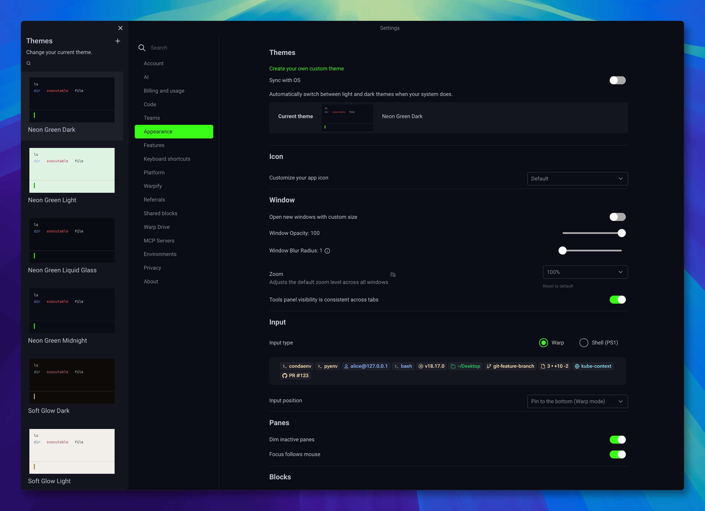

# Neon Green Theme Collection

6 VS Code themes in 2 families — vivid **Neon Green** and warm **Soft Glow** — built for developers who want their editor to feel sharp, comfortable, and unmistakably alive.

> Two aesthetics, one collection. Neon Green for electric terminal energy. Soft Glow for warm, eye-friendly coding. Both tuned for long sessions.

[Install from Marketplace](https://marketplace.visualstudio.com/items?itemName=luongnv89.neon-green-theme) · [View on GitHub](https://github.com/luongnv89/vscode-theme-neon-green) · [Read the README](https://github.com/luongnv89/vscode-theme-neon-green/blob/main/README.md)

---

## Why this theme exists

Most themes choose one of two extremes:

- visually loud, but tiring after an hour
- safe and readable, but forgettable

**Neon Green Theme Collection** offers two approaches:

- **Neon Green** — bold, electric identity with a dark terminal aesthetic
- **Soft Glow** — warm, desaturated tones that never tire your eyes
- Both with clear syntax separation and enough contrast for real work
- Both tuned for long coding sessions in any lighting

---

## Theme variants

<!-- VARIANT_CARDS -->

---

## Screenshots

### Dark Terminal


### Light Variant


---

## Installation

### Marketplace

Open VS Code, search for **Neon Green Theme Collection**, then click **Install**.

### VSIX

```bash
npm install -g @vscode/vsce
vsce package
code --install-extension neon-green-theme-1.0.0.vsix
```

### Manual

Copy the project folder into your VS Code extensions directory:

- macOS/Linux: `~/.vscode/extensions/neon-green-theme`
- Windows: `%USERPROFILE%\.vscode\extensions\neon-green-theme`

---

## iTerm2 terminal themes

Use the Neon Green palette in your terminal too. Matching iTerm2 color profiles are included in the repo:

- **Neon Green Dark** — deep midnight background (`#0b0b16`) with neon green (`#39ff14`) cursor and accents
- **Neon Green Light** — mint-green background (`#e2f5e3`) with green accents

Download: [Dark](https://github.com/luongnv89/vscode-theme-neon-green/raw/main/themes/Neon%20Green%20Dark.itermcolors) · [Light](https://github.com/luongnv89/vscode-theme-neon-green/raw/main/themes/Neon%20Green%20Light.itermcolors)

### Install in iTerm2 (manual)

1. Download the `.itermcolors` file(s) from the links above (or clone the repo).
2. Open **iTerm2 → Settings** (`⌘,`), then go to **Profiles → Colors**.
3. Click the **Color Presets…** dropdown at the bottom right and choose **Import…**.
4. Pick the downloaded `.itermcolors` file and confirm.
5. Open **Color Presets…** again and select the imported preset (e.g. *Neon Green Dark*) to apply it.
6. Repeat for every iTerm2 profile you want themed.

Double-clicking the file in Finder also imports it, but the manual route lets you target the exact profile you want.

---

## Warp terminal themes

Six Warp themes ship alongside the editor themes — one per variant. YAML files live in [`themes/warp/`](https://github.com/luongnv89/vscode-theme-neon-green/tree/main/themes/warp).



Download: [Dark](https://github.com/luongnv89/vscode-theme-neon-green/raw/main/themes/warp/neon-green-dark.yaml) · [Midnight](https://github.com/luongnv89/vscode-theme-neon-green/raw/main/themes/warp/neon-green-midnight.yaml) · [Liquid Glass](https://github.com/luongnv89/vscode-theme-neon-green/raw/main/themes/warp/neon-green-liquid-glass.yaml) · [Light](https://github.com/luongnv89/vscode-theme-neon-green/raw/main/themes/warp/neon-green-light.yaml) · [Soft Glow Dark](https://github.com/luongnv89/vscode-theme-neon-green/raw/main/themes/warp/soft-glow-dark.yaml) · [Soft Glow Light](https://github.com/luongnv89/vscode-theme-neon-green/raw/main/themes/warp/soft-glow-light.yaml)

### Install in Warp

Warp loads custom themes from `~/.warp/themes/`. Copy the YAML files there and they show up in the theme picker.

1. Clone the repo, or download individual YAML files from the links above.
2. Create the themes directory (if needed) and copy the files:

   ```bash
   mkdir -p ~/.warp/themes
   cp themes/warp/*.yaml ~/.warp/themes/
   ```

   Only want one variant? Copy a single file instead, e.g. `cp themes/warp/neon-green-dark.yaml ~/.warp/themes/`.
3. Open **Warp → Settings** (`⌘,`) → **Appearance**.
4. In the **Themes** list pick one of: **Neon Green Dark**, **Neon Green Midnight**, **Neon Green Liquid Glass**, **Neon Green Light**, **Soft Glow Dark**, or **Soft Glow Light**.
5. The theme applies instantly. If the list doesn't refresh, close and reopen the Settings window — no Warp restart needed.

Uninstall: delete the YAML files from `~/.warp/themes/` and pick a built-in Warp theme.

---

## What the theme covers

- editor chrome
- tabs, sidebar, panels, activity bar, status bar
- terminal colors
- git decorations
- bracket colors
- markdown
- syntax highlighting for common languages like JavaScript, TypeScript, Python, Rust, Go, JSON, YAML, Shell, HTML, and CSS

### Palette snapshot

<!-- PALETTE_SWATCHES -->

---

## Markdown rendering gallery

This section intentionally shows many Markdown element types so the generated page can act as a living visual reference.

### Text styles

This is a normal paragraph with **bold text**, *italic text*, ***bold italic text***, ~~strikethrough~~, and `inline code`.

You can also check a standard link style here: [VS Code Marketplace](https://marketplace.visualstudio.com/).

### Lists

#### Ordered

1. Install the theme
2. Select the variant you like
3. Open a real project
4. See if it still feels good after a full work session

#### Unordered

- Neon Green — Dark Terminal for classic neon contrast
- Neon Green — Midnight for a softer dark setup
- Neon Green — Light for daytime work
- Neon Green — Liquid Glass for modern translucent feel
- Soft Glow — Dark for warm, cozy coding
- Soft Glow — Light for gentle daylight work

#### Nested

- Editor experience
  - syntax contrast
  - bracket readability
  - git decorations
- UI chrome
  - sidebar
  - status bar
  - tabs

#### Task list

- [x] Neon Green — Dark Terminal
- [x] Neon Green — Midnight
- [x] Neon Green — Light
- [x] Neon Green — Liquid Glass
- [x] Soft Glow — Dark
- [x] Soft Glow — Light
- [ ] Your own favorite setup

### Quote

> A theme should have a point of view, but it should still help you ship.

### Table

| Element | What to look for |
| --- | --- |
| Headings | hierarchy and spacing |
| Inline code | contrast and readability |
| Tables | borders, density, scanability |
| Quotes | separation without noise |
| Lists | rhythm and indentation |

### Horizontal rule

---

### Images


---

## Syntax showcase

### TypeScript

```ts
import { EventEmitter } from 'node:events';

type ThemeVariant = 'dark' | 'midnight' | 'light';

interface InstallGuide {
  variant: ThemeVariant;
  accent: string;
  isRecommended: boolean;
}

const VARIANTS: InstallGuide[] = [
  { variant: 'dark', accent: '#39ff14', isRecommended: true },
  { variant: 'midnight', accent: '#4dff4d', isRecommended: true },
  { variant: 'light', accent: '#00a63e', isRecommended: false },
];

export class ThemeRegistry extends EventEmitter {
  constructor(private readonly variants: InstallGuide[]) {
    super();
  }

  find(variant: ThemeVariant): InstallGuide | undefined {
    return this.variants.find((item) => item.variant === variant);
  }
}
```

### Python

```python
from dataclasses import dataclass
from typing import Literal

ThemeVariant = Literal["dark", "midnight", "light"]

@dataclass
class ThemePreview:
    variant: ThemeVariant
    accent: str
    background: str

    def summary(self) -> str:
        return f"{self.variant}: accent={self.accent}, background={self.background}"

preview = ThemePreview("dark", "#39ff14", "#0e0e1a")
print(preview.summary())
```

### Rust

```rust
#[derive(Debug)]
enum Variant {
    Dark,
    Midnight,
    Light,
}

fn accent(variant: &Variant) -> &'static str {
    match variant {
        Variant::Dark => "#39ff14",
        Variant::Midnight => "#4dff4d",
        Variant::Light => "#00a63e",
    }
}

fn main() {
    let current = Variant::Dark;
    println!("accent = {}", accent(&current));
}
```

### JSON

```json
{
  "name": "neon-green-theme",
  "displayName": "Neon Green Theme Collection",
  "publisher": "luongnv89",
  "variants": ["dark", "midnight", "light", "liquid-glass", "soft-glow-dark", "soft-glow-light"],
  "accent": "#39ff14"
}
```

### Bash

```bash
npm install -g @vscode/vsce
vsce package
code --install-extension neon-green-theme-1.0.0.vsix
```

---

## Open source details

- License: **MIT**
- Publisher: **luongnv89**
- Extension type: **VS Code theme**
- Repository: [luongnv89/vscode-theme-neon-green](https://github.com/luongnv89/vscode-theme-neon-green)

If you want to improve the theme, open an issue, suggest a language-specific token tweak, or send a PR.

---

## Final call

Whether you want the electric energy of Neon Green or the cozy warmth of Soft Glow, this collection is built for developers who care about their editor.

[Install Neon Green Theme Collection](https://marketplace.visualstudio.com/items?itemName=luongnv89.neon-green-theme)
