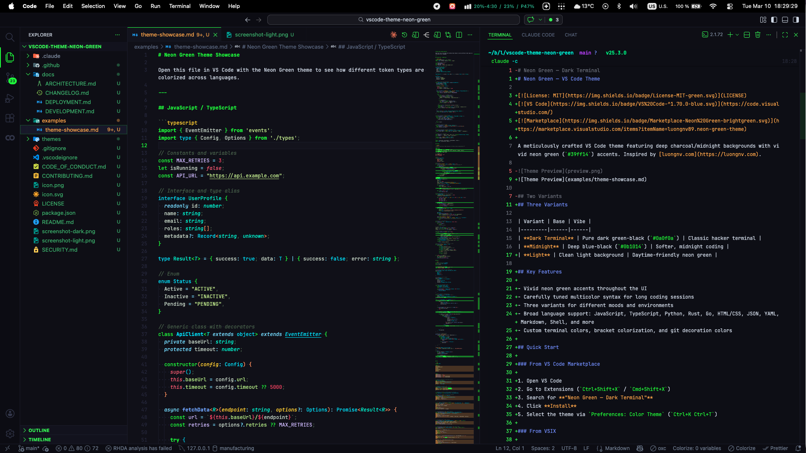
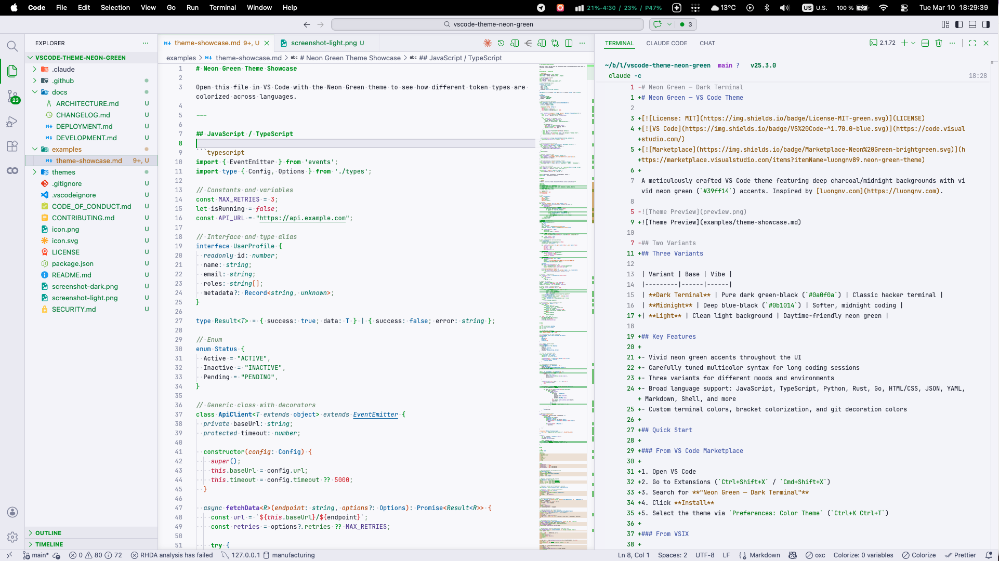
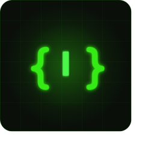

# Neon Green — VS Code Theme

A vibrant neon green VS Code theme with three variants built for people who want their editor to feel sharp, electric, and unmistakably alive.

> Deep midnight backgrounds. Vivid neon green accents. Carefully tuned syntax that stays readable during long coding sessions.

[Install from Marketplace](https://marketplace.visualstudio.com/items?itemName=luongnv89.neon-green-theme) · [View on GitHub](https://github.com/luongnv89/vscode-theme-neon-green) · [Read the README](https://github.com/luongnv89/vscode-theme-neon-green/blob/main/README.md)

---

## Why this theme exists

Most themes choose one of two extremes:

- visually loud, but tiring after an hour
- safe and readable, but forgettable

**Neon Green** tries to hit the better balance:

- a strong identity
- clear syntax separation
- a dark terminal aesthetic that still feels modern
- enough contrast to stay useful during real work

---

## Theme variants

<!-- VARIANT_CARDS -->

---

## Screenshots

### Dark Terminal



### Light Variant



---

## Installation

### Marketplace

Open VS Code, search for **Neon Green — Dark Terminal**, then click **Install**.

### VSIX

```bash
npm install -g @vscode/vsce
vsce package
code --install-extension neon-green-theme-1.0.0.vsix
```

### Manual

Copy the project folder into your VS Code extensions directory:

- macOS/Linux: `~/.vscode/extensions/neon-green-theme`
- Windows: `%USERPROFILE%\.vscode\extensions\neon-green-theme`

---

## What the theme covers

- editor chrome
- tabs, sidebar, panels, activity bar, status bar
- terminal colors
- git decorations
- bracket colors
- markdown
- syntax highlighting for common languages like JavaScript, TypeScript, Python, Rust, Go, JSON, YAML, Shell, HTML, and CSS

### Palette snapshot

<!-- PALETTE_SWATCHES -->

---

## Markdown rendering gallery

This section intentionally shows many Markdown element types so the generated page can act as a living visual reference.

### Text styles

This is a normal paragraph with **bold text**, *italic text*, ***bold italic text***, ~~strikethrough~~, and `inline code`.

You can also check a standard link style here: [VS Code Marketplace](https://marketplace.visualstudio.com/).

### Lists

#### Ordered

1. Install the theme
2. Select the variant you like
3. Open a real project
4. See if it still feels good after a full work session

#### Unordered

- Dark Terminal for classic neon contrast
- Midnight for a softer dark setup
- Light for daytime work

#### Nested

- Editor experience
  - syntax contrast
  - bracket readability
  - git decorations
- UI chrome
  - sidebar
  - status bar
  - tabs

#### Task list

- [x] Dark variant
- [x] Midnight variant
- [x] Light variant
- [ ] Your own favorite setup

### Quote

> A theme should have a point of view, but it should still help you ship.

### Table

| Element | What to look for |
| --- | --- |
| Headings | hierarchy and spacing |
| Inline code | contrast and readability |
| Tables | borders, density, scanability |
| Quotes | separation without noise |
| Lists | rhythm and indentation |

### Horizontal rule

---

### Images



---

## Syntax showcase

### TypeScript

```ts
import { EventEmitter } from 'node:events';

type ThemeVariant = 'dark' | 'midnight' | 'light';

interface InstallGuide {
  variant: ThemeVariant;
  accent: string;
  isRecommended: boolean;
}

const VARIANTS: InstallGuide[] = [
  { variant: 'dark', accent: '#39ff14', isRecommended: true },
  { variant: 'midnight', accent: '#4dff4d', isRecommended: true },
  { variant: 'light', accent: '#00a63e', isRecommended: false },
];

export class ThemeRegistry extends EventEmitter {
  constructor(private readonly variants: InstallGuide[]) {
    super();
  }

  find(variant: ThemeVariant): InstallGuide | undefined {
    return this.variants.find((item) => item.variant === variant);
  }
}
```

### Python

```python
from dataclasses import dataclass
from typing import Literal

ThemeVariant = Literal["dark", "midnight", "light"]

@dataclass
class ThemePreview:
    variant: ThemeVariant
    accent: str
    background: str

    def summary(self) -> str:
        return f"{self.variant}: accent={self.accent}, background={self.background}"

preview = ThemePreview("dark", "#39ff14", "#0e0e1a")
print(preview.summary())
```

### Rust

```rust
#[derive(Debug)]
enum Variant {
    Dark,
    Midnight,
    Light,
}

fn accent(variant: &Variant) -> &'static str {
    match variant {
        Variant::Dark => "#39ff14",
        Variant::Midnight => "#4dff4d",
        Variant::Light => "#00a63e",
    }
}

fn main() {
    let current = Variant::Dark;
    println!("accent = {}", accent(&current));
}
```

### JSON

```json
{
  "name": "neon-green-theme",
  "displayName": "Neon Green — Dark Terminal",
  "publisher": "luongnv89",
  "variants": ["dark", "midnight", "light"],
  "accent": "#39ff14"
}
```

### Bash

```bash
npm install -g @vscode/vsce
vsce package
code --install-extension neon-green-theme-1.0.0.vsix
```

---

## Open source details

- License: **MIT**
- Publisher: **luongnv89**
- Extension type: **VS Code theme**
- Repository: [luongnv89/vscode-theme-neon-green](https://github.com/luongnv89/vscode-theme-neon-green)

If you want to improve the theme, open an issue, suggest a language-specific token tweak, or send a PR.

---

## Final call

If you want a theme that feels like a neon terminal without becoming unreadable chaos, this one is built for that exact sweet spot.

[Install Neon Green now](https://marketplace.visualstudio.com/items?itemName=luongnv89.neon-green-theme)
